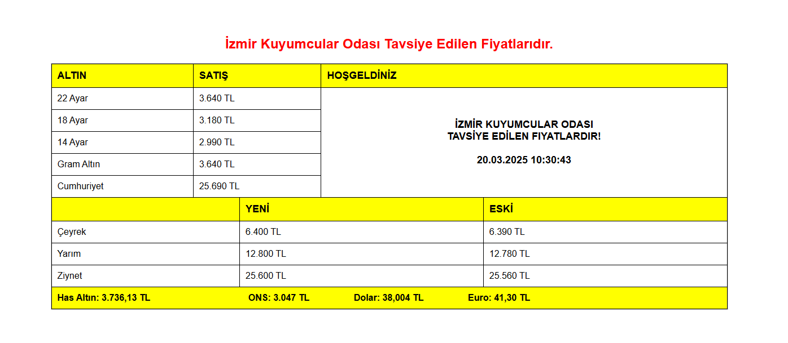

İzmir Kuyumcular Odası Fiyat Takip Sistemi

 
<em>Değerli Metal ve Kuyumculuk Ürünleri Fiyat Takip Platformu</em>

📋 Proje Hakkında
Bu platform, İzmir Kuyumcular Odası tarafından yayınlanan tavsiye edilen fiyat listesini ve güncel piyasa verilerini takip eden kapsamlı bir sistemdir. Kuyumculuk sektöründeki profesyoneller ve yatırımcılar için geliştirilmiştir.
---
✨ Özellikler
🔄 Canlı Veri Takibi: İzmir Kuyumcular Odası resmi tavsiye fiyatlarının anlık güncellemeleri
📊 Detaylı Analizler: Günlük, haftalık ve aylık bazda fiyat değişim grafikleri
📱 Mobil Erişim: Responsive tasarım ile her cihazdan kolay erişim
🔔 Bildirim Sistemi: Önemli fiyat değişikliklerinde anlık uyarılar
🔍 Gelişmiş Arama: Ürün kategorilerine göre filtreleme ve karşılaştırma
📈 Trend Göstergeleri: Piyasa eğilimlerini görselleştiren göstergeler
---
🚀 Kurulum
---
💻 Kullanım Kılavuzu
Ana sayfada güncel fiyat tablosunu görüntüleyin
Kategorilere göre filtreleme yapın
Geçmiş veriler için "Analiz" sekmesini kullanın
Fiyat alarmları için "Bildirimler" bölümünü ayarlayın
Hesaplama araçları ile yatırım planlaması yapın
---
📊 Güncel Fiyat Listesi

| Ürün | Alış Fiyatı (TL/gr) | Satış Fiyatı (TL/gr) | Değişim (%) |
|:------:|:---------------------:|:----------------------:|:------------:|
| 22 Ayar Bilezik | 2.450,00 | 2.480,00 | +1.2% |
| 14 Ayar Altın | 1.580,00 | 1.610,00 | +0.8% |
| 24 Ayar Has Altın | 2.670,00 | 2.695,00 | +1.5% |
| Gümüş | 32,50 | 34,20 | +0.3% |
| Çeyrek Altın | 4.560,00 | 4.620,00 | +1.3% |

---
📈 Grafik Analizler

---
🔄 Güncelleme Döngüsü
Piyasa Açık Saatleri: Her 15 dakikada bir güncelleme
Kapanış Verileri: Her gün saat 18:00'de kayıt
Haftalık Raporlar: Her Cuma saat 19:00'da yayınlanma
Ay Sonu Analizi: Her ayın son iş günü detaylı analiz
---
🌐 Veri Kaynakları
İzmir Kuyumcular Odası resmi web sitesi
Borsa İstanbul (BİST) Kıymetli Madenler Piyasası
Merkez Bankası döviz kurları
Uluslararası piyasa verileri (LBMA, COMEX)
---
📞 İletişim

Soru, öneri ve şikayetleriniz için bizimle iletişime geçin:

<strong>E-posta:</strong> iletisim@kuyumcufiyattakip.com 
<strong>Telefon:</strong> +90 232 XXX XX XX 
<strong>Adres:</strong> İzmir Kuyumcular Çarşısı, No:123, Konak/İZMİR

---
📜 Lisans

Bu proje MIT lisansı altında lisanslanmıştır.

© 2023 İzmir Kuyumcular Odası Fiyat Takip Sistemi

